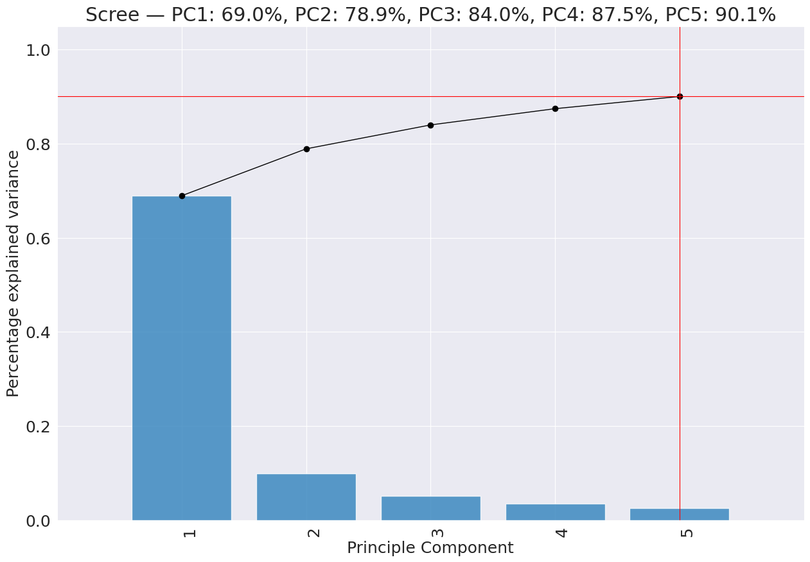
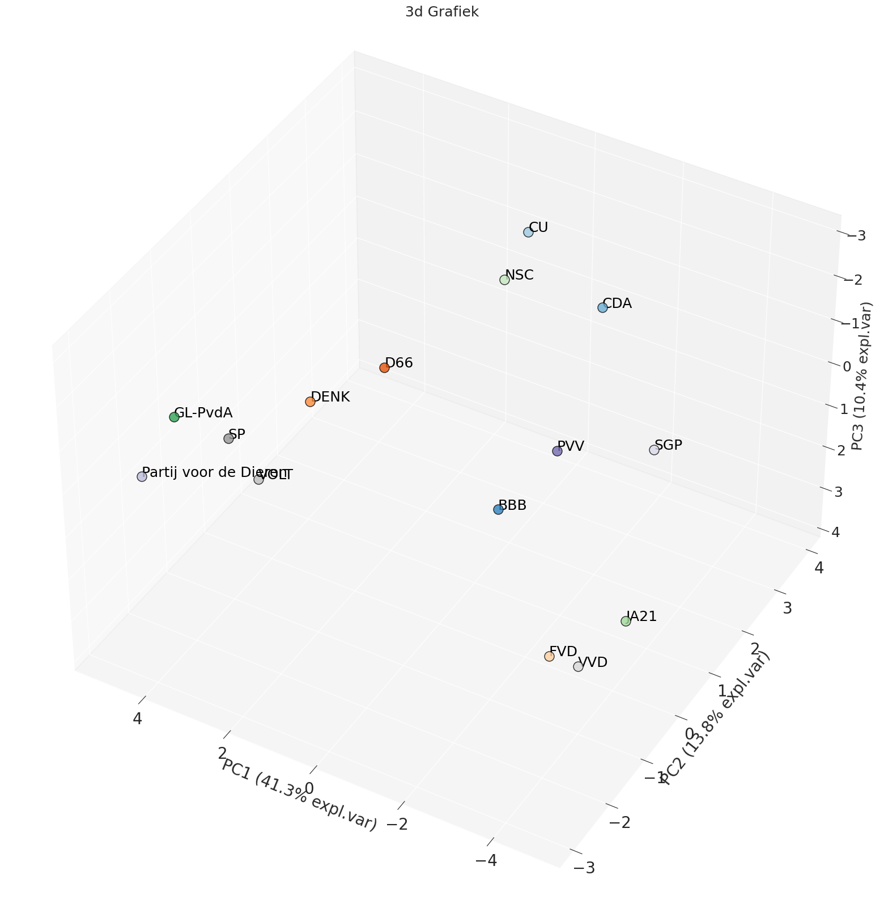
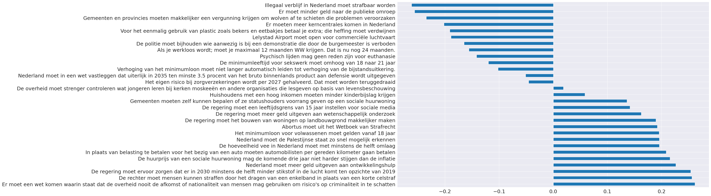

# 1. Hoofdcomponentenanalyse

Hoofdcomponentenanalyse (PCA) is een statistische techniek die wordt gebruikt voor dimensionale reductie. Dit is een methode  waarmee de dimensies of variabelen van een dataset worden verminderd, terwijl zo veel mogelijk relevante informatie behouden blijft. Het doel is om de complexiteit van gegevens te verminderen door de dataset om te zetten in een lagere-dimensionale ruimte, terwijl belangrijke patronen en relaties in de gegevens behouden blijven.

De overgebleven dimensies, de 'hoofdcomponenten' zijn combinaties van de oorspronkelijke variabelen en kunnen worden gebruikt om de belangrijkste patronen in de data te identificeren. Hierdoor wordt het mogelijk om de data te visualiseren in een grafiek met minder dimensies. Niet elk component verklaart evenveel van de variantie in de data. De eerste component verklaart de meeste variantie, de tweede component verklaart de meeste variantie van de overgebleven variantie, enzovoort. De toegevoegde waarde van een component neemt hierdoor af naarmate er meer componenten worden toegevoegd, omdat elk nieuw component een kleiner deel van de totale variantie verklaart.

# 2. Analyse stemhulpen

Dit is een analyse van hoe de verschillende partijen zich tot elkaar verhouden op basis van de stellingen uit de stemhulpen. Het doel is om hierdoor een beter beeld te kunnen geven van het antwoord op vragen als: "Waar bevindt de NSC zich op het politieke spectrum?", "Hoeveel overlap is er tussen de partijen?".

Elke vraag in een stemhulp vertegenwoordigt een dimensie, dit betekent dat een stemhulp met dertig vragen een dertigdimensionale dataset oplevert. Om deze data alsnog te kunnen visualiseren is er een hoofdcomponentenanalyse toegepast op de gegevens van alle stemhulpen om het aantal dimensies terug te brengen tot één, twee of drie dimensies. Hierdoor is het mogelijk de posities van de partijen in een grafiek weer te geven. Partijen die zich dicht bij elkaar bevinden zijn het met elkaar eens, partijen die ver van elkaar afstaan, verschillen sterker van mening. Het is belangrijk te beseffen dat niet elke as (of 'component') evenveel van de variantie verklaart. In de grafieken staat per as aangegeven welk deel van de variantie wordt verklaard en dus ook hoe 'belangrijk' deze as is.

Per component is er een analyse gemaakt van de stellingen die de grootste invloed hebben op de positie van de partijen. Hierdoor wordt inzichtelijk gemaakt wat een as in de grafiek representeert. De antwoorden van de partijen op de stellingen zijn gecodeerd als getallen. Hoe hoger het getal, hoe meer de partij het eens is met de stelling, negatieve waarden betekenen dat de partij het oneens is met de stelling. Deze antwoorden worden vermenigvuldigd met de waarden ('loadings') die de stellingen hebben voor het betreffende component. De som van deze vermenigvuldigingen bepaalt de positie van de partij op dat component.

Tot slot heb ik de correlatie tussen de antwoorden van de partijen berekend. Hoe hoger de correlatie, hoe groter de mate waarin de partijen het met elkaar eens zijn.

# Kieskompas en Stemwijzer gecombineerd

### Scree plot (Totaal verklaarde variantie per component)

## Pca Scatter plots
### 1d

### 2d

### 3d

## Loadings componenten
### Component 1

### Component 2

## Correlatie tabel

# Kieskompas

### Scree plot (Totaal verklaarde variantie per component)

## Pca Scatter plots
### 1d (Kieskompas)

### 2d (Kieskompas)

### 3d (Kieskompas)

## Loadings componenten
### Component 1 (Kieskompas)

### Component 2 (Kieskompas)

## Correlatie tabel (Kieskompas)

# Stemwijzer

### Scree plot (Totaal verklaarde variantie per component)

## Pca Scatter plots
### 1d (Stemwijzer)

### 2d (Stemwijzer)

### 3d (Stemwijzer)

## Loadings componenten
### Component 1 (Stemwijzer)

### Component 2 (Stemwijzer)

## Correlatie tabel (Stemwijzer)
